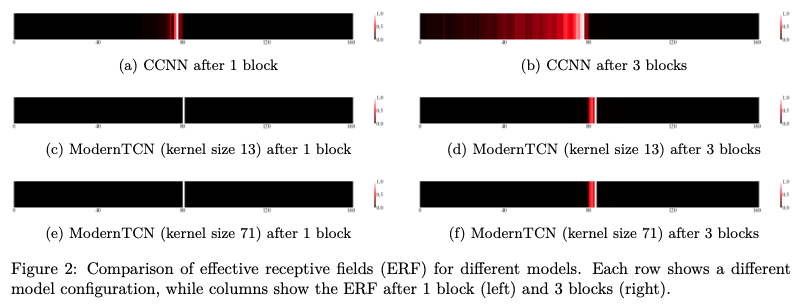

# [ModernTCN Revisited: A Reproducibility Study with Extended Benchmarks and Architectural Improvement](https://openreview.net/forum?id=R20kKdWmVZ)

This is the official repository for the [reproducibility study](https://openreview.net/forum?id=R20kKdWmVZ) (TMLR) of [ModernTCN: A Modern Pure Convolution Structure for General Time Series Analysis](https://openreview.net/forum?id=vpJMJerXHU#) (ICLR 2024 Spotlight).

## Highlights

**Highlights:** 


 * Visualization of ERF. ModernTCN vs. CCNN * 

## Get Started

1. Install Python 3.12.7 and necessary dependencies.
```
pip install -r requirements.txt
```

2. Download data. You can obtain most datasets from [Times-series-library](https://github.com/thuml/Time-Series-Library). For Speech Commands and PhysioNet datasets, use the provided download scripts:
```
cd ./ModernTCN-classification-extension/scripts
sh download_speech.sh
sh download_physionet.sh
```

3. Long-term forecasting tasks.
```
cd ./ModernTCN-Long-term-forecasting
sh ./scripts/ETTh2.sh
```

4. Short-term forecasting tasks (extended).
```
cd ./ModernTCN-short-term-extension
sh ./scripts/ETTm1.sh
```

5. Imputation tasks.
```
cd ./ModernTCN-imputation
sh ./scripts/ETTh2.sh
```

6. Classification tasks (extended).
```
cd ./ModernTCN-classification-extension
sh ./scripts/physionet.sh
sh ./scripts/speech_mfcc.sh
```

7. Anomaly detection tasks.
```
cd ./ModernTCN-detection
sh ./scripts/SWaT.sh
```

8. ERF Visualization for Speech Commands MFCC (two-step process):
   
   Step 1: First train a model using the speech_mfcc.sh script to generate checkpoints, then generate ERF scores. Choose one of the following commands based on kernel size:
   ```
   cd ./ModernTCN-classification-extension
   
   # For kernel size 13
   python -u run.py --model_id Speech_Final_L13 --des Final_S_ks_3 --task_name classification --is_training 0 --root_path ./all_datasets/speech --data SpeechCommands --model ModernTCN --seq_len 161 --enc_in 20 --ffn_ratio 1 --patch_size 1 --patch_stride 1 --num_blocks 1 1 1 --large_size 13 13 13 --small_size 5 5 5 --dims 32 32 32 --head_dropout 0.0 --dropout 0.0 --class_dropout 0.0 --use_multi_scale False --mfcc True --visualize_erf --erf_block_idx 0 --weights_path checkpoints/Speech_Final_L13_ModernTCN_SpeechCommands_ftM_sl161_pl0_dim32_nb1_lk13_sk5_ffr1_ps1_str1_multiFalse_mergedFalse_Final_S_ks_3_2 --erf_save_path erf_scores.npy --batch_size 1 --num_erf_samples 50
   
   # For kernel size 31
   python -u run.py --model_id Speech_Final_L31 --des Final_S_ks_3 --task_name classification --is_training 0 --root_path ./all_datasets/speech --data SpeechCommands --model ModernTCN --seq_len 161 --enc_in 20 --ffn_ratio 1 --patch_size 1 --patch_stride 1 --num_blocks 1 1 1 --large_size 31 29 27 --small_size 5 5 5 --dims 32 32 32 --head_dropout 0.0 --dropout 0.0 --class_dropout 0.0 --use_multi_scale False --mfcc True --visualize_erf --erf_block_idx 0 --weights_path checkpoints/Speech_Final_L31_ModernTCN_SpeechCommands_ftM_sl161_pl0_dim32_nb1_lk31_sk5_ffr1_ps1_str1_multiFalse_mergedFalse_Final_S_ks_3_2 --erf_save_path erf_scores.npy --batch_size 1 --num_erf_samples 50
   
   # For kernel size 51
   python -u run.py --model_id Speech_Final_L51 --des Final_S_ks_3 --task_name classification --is_training 0 --root_path ./all_datasets/speech --data SpeechCommands --model ModernTCN --seq_len 161 --enc_in 20 --ffn_ratio 1 --patch_size 1 --patch_stride 1 --num_blocks 1 1 1 --large_size 51 49 47 --small_size 5 5 5 --dims 32 32 32 --head_dropout 0.0 --dropout 0.0 --class_dropout 0.0 --use_multi_scale False --mfcc True --visualize_erf --erf_block_idx 0 --weights_path checkpoints/Speech_Final_L51_ModernTCN_SpeechCommands_ftM_sl161_pl0_dim32_nb1_lk51_sk5_ffr1_ps1_str1_multiFalse_mergedFalse_Final_S_ks_3_2 --erf_save_path erf_scores.npy --batch_size 1 --num_erf_samples 50
   ```
   
   Step 2: Visualize the ERF from the generated scores
   ```
   cd ./ModernTCN-classification-extension
   python erf/analyze_erf.py --source ./erf_scores.npy --heatmap_save ./erf/img/mtcn_kernel_size_block_idx.png
   ```
   Replace "kernel_size" and "block_idx" in the filename with the appropriate values (e.g., mtcn_51_0.png for kernel size 51, block index 0).

**Note:** The official ModernTCN source code does not provide code to visualize ERF. We adapted our visualization code from [RepLKNet-pytorch](https://github.com/DingXiaoH/RepLKNet-pytorch) to analyze the ERF for Speech Commands MFCC features.

## Citation

Our paper is currently under review. Below is the original ModernTCN paper:
```
@inproceedings{
donghao2024moderntcn,
title={Modern{TCN}: A Modern Pure Convolution Structure for General Time Series Analysis},
author={Luo donghao and wang xue},
booktitle={The Twelfth International Conference on Learning Representations},
year={2024},
url={https://openreview.net/forum?id=vpJMJerXHU}
}
```

## Acknowledgement

We appreciate the following github repos for their valuable code base or datasets:

https://github.com/luodhhh/ModernTCN https://github.com/ts-kim/RevIN https://github.com/PatchTST/PatchTST https://github.com/thuml/Time-Series-Library https://github.com/facebookresearch/ConvNeXt https://github.com/MegEngine/RepLKNet https://github.com/dwromero/ckconv https://github.com/patrick-kidger/NeuralCDE
