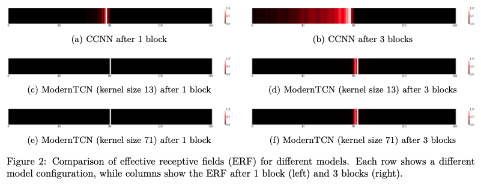

# ModernTCN Revisited: A Reproducibility Study with Extended Benchmarks

This repository contains the code and results for our paper "ModernTCN Revisited: A Reproducibility Study with Extended Benchmarks", which evaluates the reproducibility of the ModernTCN model introduced in [ModernTCN: A Modern Pure Convolution Structure for General Time Series Analysis](https://openreview.net/forum?id=vpJMJerXHU#) (ICLR 2024 Spotlight).

## Our Paper

We present a comprehensive reproducibility analysis of ModernTCN, validating its experimental setup and performance claims while extending the evaluation to additional datasets and tasks. Our study:

1. Reproduces the original ModernTCN experiments across five time series analysis tasks
2. Extends evaluation to include short-term forecasting on ETT datasets
3. Compares ModernTCN with other convolutional models on Speech Commands classification
4. Examines ModernTCN's performance on irregularly sampled data (PhysioNet)
5. Conducts ablation studies on the ConvFFN2 component

## Key Findings

- ModernTCN achieves competitive performance across various time series tasks, though its state-of-the-art claims are tempered by sensitivity to experimental settings
- Performance on Speech Commands lags behind other convolutional methods with larger effective receptive fields
- ModernTCN exhibits less parameter efficiency compared to other methods
- Ablation studies confirm the importance of the ConvFFN2 component in handling irregularly sampled data

## ModernTCN Block

**ModernTCN block design:** 
ModernTCN block aims to achieve larger effective receptive fields (ERF) and better capture cross-variable dependency.

| | 
|:--:|:--:|
| *Figure 1. ModernTCN block design.* | *Figure 2. Visualization of ERF.* |

## Datasets

Our study evaluates ModernTCN on multiple datasets across five tasks:

- **Long-term forecasting**: ETT, Electricity, Traffic, Weather, Exchange, ILI
- **Short-term forecasting**: ETTh1, ETTm1 (extended evaluation)
- **Imputation**: ETT, Electricity, Weather
- **Classification**: Speech Commands, PhysioNet (extended evaluation)
- **Anomaly detection**: SMD, MSL, SMAP, SWaT, PSM

## Get Started

1. Install Python 3.7 and necessary dependencies.
```
pip install -r requirements.txt
```
2. Download data. You can obtain all datasets from [[Times-series-library](https://github.com/thuml/Time-Series-Library)].

3. Long-term forecasting tasks.
 
We provide the long-term forecasting experiment coding in `./ModernTCN-Long-term-forecasting` and experiment scripts can be found under the folder `./scripts`. To run the code on ETTh2, just run the following command:

```
cd ./ModernTCN-Long-term-forecasting

sh ./scripts/ETTh2.sh
```

4. Short-term forecasting tasks.

We provide the short-term forecasting experiment coding in `./ModernTCN-short-term` and experiment scripts can be found under the folder `./scripts`. To run the code on ETT, just run the following command:

```
cd ./ModernTCN-short-term

sh ./scripts/ETT.sh
```

5. Imputation tasks.

We provide the imputation experiment coding in `./ModernTCN-imputation` and experiment scripts can be found under the folder `./scripts`. To run the code on ETTh2, just run the following command:

```
cd ./ModernTCN-imputation

sh ./scripts/ETTh2.sh
```

6. Classification tasks.

We provide the classification experiment coding in `./ModernTCN-classification` and experiment scripts can be found under the folder `./scripts`. To run the code on Speech Commands, just run the following command:

```
cd ./ModernTCN-classification

sh ./scripts/speech_commands.sh
```

7. Anomaly detection tasks.

We provide the anomaly detection experiment coding in `./ModernTCN-detection` and experiment scripts can be found under the folder `./scripts`. To run the code on SWaT, just run the following command:

```
cd ./ModernTCN-detection

sh ./scripts/SWaT.sh
```

## Citation

If you find this repo useful, please cite our paper and the original ModernTCN paper. 
```
@inproceedings{
donghao2024moderntcn,
title={Modern{TCN}: A Modern Pure Convolution Structure for General Time Series Analysis},
author={Luo donghao and wang xue},
booktitle={The Twelfth International Conference on Learning Representations},
year={2024},
url={https://openreview.net/forum?id=vpJMJerXHU}
}
```

## Acknowledgement

We appreciate the following github repos a lot for their valuable code base or datasets:

https://github.com/luodhhh/ModernTCN
https://github.com/ts-kim/RevIN
https://github.com/PatchTST/PatchTST
https://github.com/thuml/Time-Series-Library
https://github.com/facebookresearch/ConvNeXt
https://github.com/MegEngine/RepLKNet
